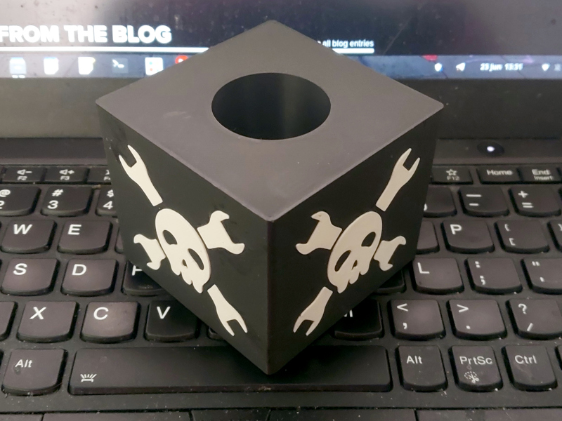

# Microphone-Cube
A 3D printable reporter's microphone cube made with openSCAD, with a Hackaday logo if necessary.

## mic-cube.scad
This holds the cube shape with the microphone barrel through the middle. and optionally four Hackaday logos let into the sides.

If you want the hackaday logo you'll have to download the Thingiverse model mentioned in the SCAD files, otherwise comment out the lines relating to it as indicated in the code.

The microphone body measurements for the microphone barrel hole are a conical section derived from measuring my Behringer SM58 clone. You may want to measure your own microphone and apply changes here as needed.

## white-hackaday-logo.scad
This is a flat Hackaday logo. If you have a multi filament printer you can position these in the sides of the cube for an all in one print, otherwise you can print them separately and glue them in. Again, it needs the Hackaday logo from Thingiverse.

## Alternate way to apply the logo
As an alternative to printing the logo inserts you can drip paint with a steady hand into the logo shaped insets on the cube, and let it dry.
